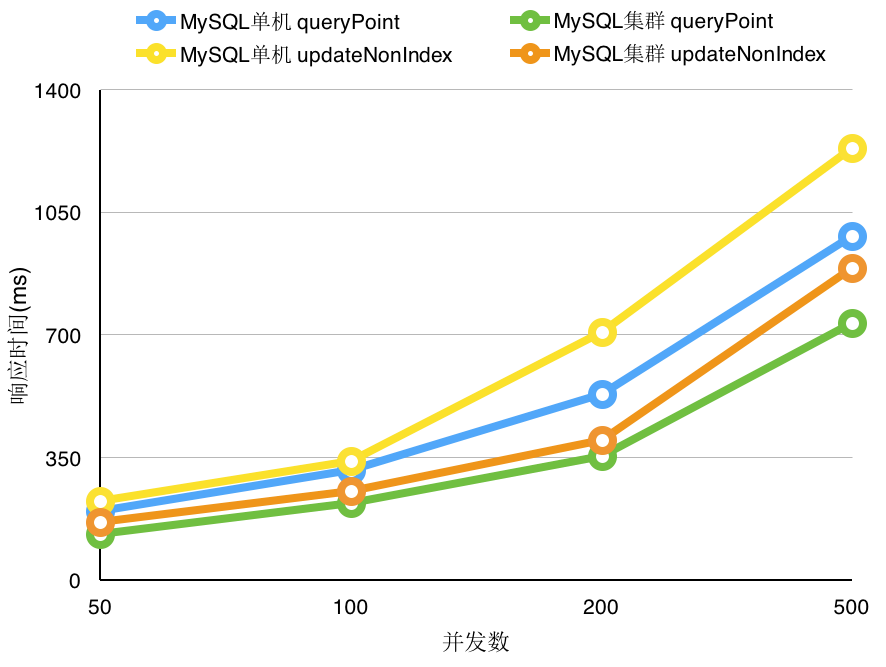
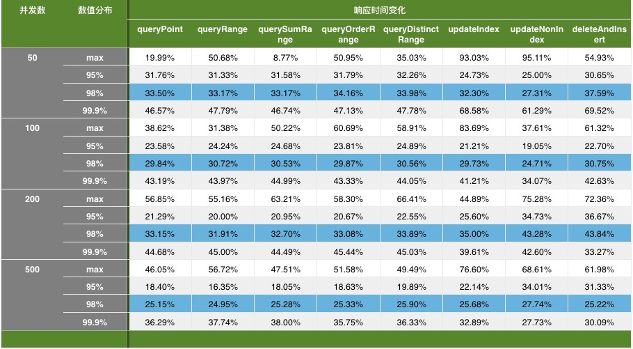

# MySQL主从数据库测试

(2016-08, created by [Zhu Yin](mailto:zhuyin@chinamobile.com))

# 功能测试

## 读写分离测试

> 测试`Connnection`设置为`readOnly`的请求走从库，而没有设置的走主库。

通过在选择数据源时，日志输出所选择的数据源信息，及登录mysql shell，执行`show processlist;`查看正在执行的sql，确认实际运行情况符合预期。

## 故障切换测试

> 测试一个从库宕掉后，程序读写正常。

经测试证明：一个从库宕掉后，应用程序可平滑无报错的切换到其他从库访问，当所有从库宕掉后，可通过主库访问。

# 性能测试

比较常用的MySQL基准压力测试工具有 [tpcc-mysql](https://github.com/Percona-Lab/tpcc-mysql)、[sysbench](https://github.com/akopytov/sysbench)、[mysqlslap](http://dev.mysql.com/doc/refman/5.6/en/mysqlslap.html) 等。然而，它们不能连接MySQL主从集群进行测试。为此，参考sysbench的源码，开发了测试工具`bench-test`。

采用bench-test对单点查询、区间查询、区间求和、区间求唯一、索引更新、非索引更新、删除并插入等多种操作进行了测试。

## 性能对比曲线
### 单点查询及非索引更新

随着并发数的增加，MySQL单机及MySQL集群的单点查询（queryPoint）和非索引更新（updateNonIndex）的响应时间均有所增加，但是MySQL集群的用时总是显著低于MySQL单机的。

以下曲线是基于`98%的响应用时`绘制的。

> `98%的响应用时`，指所有测试中，98%的响应用时不大于的数值。

### 区间排序

### 删除并更新

## 响应时间对比

由图表可见，相比MySQL单机，MySQL主从集群的读、写操作的响应时间均有大幅减少，且`最大响应时间 (max)`显著降低，`最大响应时间`的大幅降低可减弱MySQL性能波动对应用程序的影响。

