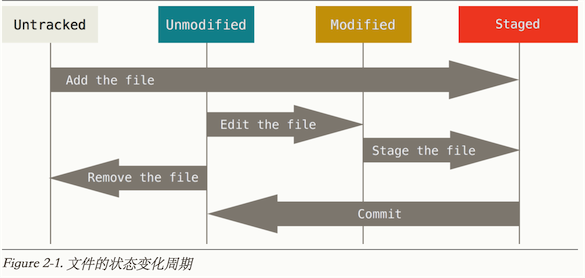

[TOC]

# 简介

Git是目前世界上被最广泛使用的现代软件版本管理系统。Git本身亦是一个成熟并处于活跃开发状态的开源项目，它最初是由Linux操作系统内核的创造者Linus Torvalds在2005年创造。

## Git的优势

- Git是分布式的，而且Git平台比较多,GitLab, coding.net, GitHub等等；
- Git可以现在本地执行，可以在本地进行commit，而SVN每次commit都必须是提交到主机；
- Git能保证数据完整性，Git中所有数据在存储前都计算校验和，然后以校验来引用,所以你在传送过程中丢失文件，Git都知道。

## Git的工作区、暂存区和版本区


在这个图中，我们可以看到部分 Git 命令是如何影响工作区和暂存区（stage, index）的。

- 图中左侧为工作区，右侧为版本库。在版本库中标记为 "index" 的区域是暂存区（stage, index），标记为 "master" 的是 master 分支所代表的目录树。
- 图中我们可以看出此时 "HEAD" 实际是指向 master 分支的一个“游标”。所以图示的命令中出现 HEAD 的地方可以用 master 来替换。
- 图中的 objects 标识的区域为 Git 的对象库，实际位于 ".git/objects" 目录下，我们会在后面的章节重点介绍。
- 当对工作区修改（或新增）的文件执行 "git add" 命令时，暂存区的目录树被更新，同时工作区修改（或新增）的文件内容被写入到对象库中的一个新的对象中，而该对象的ID 被记录在暂存区的文件索引中。
- 当执行提交操作（git commit）时，暂存区的目录树写到版本库（对象库）中，master 分支会做相应的更新。即 master 指向的目录树就是提交时暂存区的目录树。
- 当执行 "git reset HEAD" 命令时，暂存区的目录树会被重写，被 master 分支指向的目录树所替换，但是工作区不受影响。
- 当执行 "git rm --cached <file>" 命令时，会直接从暂存区删除文件，同时**也将该文件从版本管理中移除了**，工作区则不做出改变。
- 当执行 "git checkout ." 或者 "git checkout -- <file>" 命令时，会用暂存区全部或指定的文件替换工作区的文件。这个操作很危险，会清除工作区中未添加到暂存区的改动。
- 当执行 "git checkout HEAD ." 或者 "git checkout HEAD <file>" 命令时，会用 HEAD 指向的 master 分支中的全部或者部分文件替换暂存区和以及工作区中的文件。这个命令也是极具危险性的，因为不但会清除工作区中未提交的改动，也会清除暂存区中未提交的改 动。

## Git的状态

本地仓库由 git 维护的三棵“树”组成。第一个是你的工作区，它持有实际文件；第二个是暂存区或缓存区(Index)，它像个缓存区域，临时保存你的改动；最后是 HEAD，指向你最近一次提交后的结果。

三种状态:

- 未修改: 没有修改
- 已修改: 修改了,但还没放入暂存区
- 已暂存: 如果作了修改并放入暂存区域，就属于已暂存

其实还有二种形式可分

1. 未跟踪: 在本地未git add的就是未跟踪的；
2. 已跟踪: 上述三种状态都是已跟踪状态.



# 快速指南

## 安装Git

- Mac：`brew install git`
- Redhat/Centos：`yum install git`
- Windows：下载安装[Git SCM](https://git-scm.com/download/win)

## 检出仓库

执行如下命令以创建一个本地仓库的克隆版本： `git clone /path/to/repository`

如果是远端服务器上的仓库，你的命令会是这个样子： `git clone username@host:/path/to/repository` （通过SSH） 或者： `git clone https:/path/to/repository.git` （通过https）

比如说`git clone https://github.com/geeeeeeeeek/git-recipes.git`可以将git教程clone到你指定的目录。

获取指定commit

```shell
$ git clone $URL
$ cd $PROJECT_NAME
$ git reset --hard $SHA1
```

To again go back to the most recent commit

```shell
$ git pull
```

## 签出到非空目录
想使用Git把档案获取到某个已存在的目录下错误
fatal: destination path ‘文件夹名’ git clone already exists and is not an empty directory

解决办法，在文件夹目录下执行以下命令：

```sh
git init
git remote add origin gitpath
git fetch
git branch master origin/master
git checkout master
```

或者先签出到其他路径，之后`copy -rf tmpdir dstdir`

## 创建新仓库

创建新文件夹，切换路径到该文件夹，然后执行 `git init`以创建新的 git 仓库。

## 添加与提交

当新增文件时，使用如下命令把他们加入到暂存区：

```shell
git add
```

使用如下命令以提交修改：

```shell
git commit -m "代码提交信息"
```

现在，你的改动已经提交到了 HEAD，但是还没到你的远端仓库。

## 推送改动

你的改动现在已经在本地仓库的 HEAD 中了。执行如下命令以将这些改动提交到远端仓库：

```shell
git push origin master
```

可以把 master 换成你想要推送的任何分支。

如果你还没有克隆现有仓库，并欲将你的仓库连接到某个远程服务器，你可以使用如下命令添加：

```shell
git remote add origin <server>
```

这样你就能够将你的改动推送到所添加的服务器上去了。

这里`origin`是`< server >`的别名。
如果你还没有git仓库，可以在码云、Github等代码托管平台上创建一个空(不要自动生成README.md)的repository，然后将代码push到远端仓库。

## 示例

```shell
$ cd /tmp
$ mkdir samplePrj
$ cd samplePrj/
$ git init # 创建.git目录初始化git
Initialized empty Git repository in /private/tmp/samplePrj/.git/
$ touch README.md
$ git add . # 添加当前目录的所有文件到git中，放入暂存区
$ git commit -m 'virgin' # 提交修改
[master (root-commit) 86a264c] virgin
 1 file changed, 0 insertions(+), 0 deletions(-)
 create mode 100644 README.md
```

# Git配置

## 配置文件

按照配置的作用域，配置有如下三种类型:

1,  全局系统配置
- 配置文件路径 `/etc/gitconfig`
- 通过命令修改全局系统配置 `git config --system ...`

2, 当前用户配置
- 配置文件 `~/.gitconfig` 或者 `~/.config/git/config`
- 通过命令修改当前用户配置 `git config --global ...`

3, 当前项目配置
- 配置文件 `./git/config`
- 通过命令修改当前项目配置 `git config ...`

当这些文件中的配置项冲突时，本地仓库设置覆盖用户设置，用户设置覆盖系统设置。

## 查看配置

可以通过以下方式查看当前配置：

- 直接打开配置文件进行查看
- 通过命令查看 `git config --list`

## 配置文件忽略

配置为忽略的文件将不会主动被git管理。在当前项目根路径下配置` .gitignore`。

文件 .gitignore 的格式规范如下：

    所有空行或者以注释符号`#`开头的行都会被 Git 忽略。
    可以使用标准的 glob 模式匹配。
    要忽略指定模式以外的文件或目录，可以在模式前加上惊叹号`!`取反。

示例：

```shell
# my project tmps
food/conf

# tmp files
dump.rdb

# Compiled sources
*.o
*.class
*.pyc
target

# Package Files #
*.jar
*.war
*.ear

# virtual machine crash logs, see http://www.java.com/en/download/help/error_hotspot.xml
hs_err_pid*

# project ide configs
*.iml
.idea
.classpath
.mymetadata
.project
.settings

# other file types
*.log
.svn
diff.patch
nohup.out
```

## 设置用户名和邮箱

用户名和邮箱信息是提交更新必须的。

```shell
git config --global user.name "404_K"
git config --global user.email 404_K@example.com
```

## git status显示中文

默认状态下，执行`git status`不能正确显示中文（当修改的文件名包含中文字符时）。为了正确显示中文，执行如下命令即可

```shell
git config --global core.quotepath false
```

## 配置文件名大小写敏感

git 默认是文件名大小写不敏感的。

解决办法：

```shell
git config --global core.ignorecase false
```

上述配置不一定有效，进一步解决办法是使用如下脚本修改文件名。

```shell
git mv -f OldFileNameCase newfilenamecase
```

参考：http://stackoverflow.com/questions/17683458/how-do-i-commit-case-sensitive-only-filename-changes-in-git

# 基本操作

## 初始化仓库

### git init

`git init`命令创建一个新的Git仓库。它用来将已存在但还没有版本控制的项目转换成一个Git仓库，或者创建一个空的新仓库。大多数Git命令在未初始化的仓库中都是无法使用的，所以这就是你运行新项目的第一个命令了。

运行`git init`命令会在你项目的根目录下创建一个新的.git目录，其中包含了你项目必需的所有元数据。除了`.git`目录之外，已经存在的项目不会被改变（就像SVN一样，Git不强制每个子目录中都有一个`.git`目录）。

**用法**

```shell
git init
```

将当前的目录转换成一个Git仓库。它在当前的目录下增加了一个.git文件夹，于是就可以开始记录项目版本了。

## 克隆已有仓库

### git clone

如果项目在其他仓库已经设置完毕，`git clone`是用户获取开发副本最常见的方式。

`git clone`命令拷贝整个Git仓库。这个命令就像`svn checkout`一样，除了”工作副本“是一个完备的Git仓库——它包含自己的历史，管理自己的文件，以及环境和原仓库完全隔离。

为了方便起见，clone自动创建了一个名为origin的连接，指向原有仓库。

**用法**

```shell
git clone <repo>
```

将位于`<repo>`的仓库克隆到本地机器。原仓库可以在本地文件系统中，或是通过HTTP或SSH连接的远程机器。

示例：

```shell
# 普通获取
git clone git@git.oschina.net:chookin/Pyassess.git

# 只获取最新版本，减少网络传输
git clone git@github.com:MyCATApache/Mycat-Server.git --depth=1

# 获取指定分支
git clone -b release_branch https://github.com/jetty/
git clone -b php7  https://github.com/php-memcached-dev/php-memcached.git --depth=1
```

## 保存你的更改

### git add

`git add`命令将工作目录中的变化添加到缓存区。它告诉Git你想要在下一次提交时包含这个文件的更新。但是，`git add`不会怎么影响你的仓库——在你运行`git commit`前更改都不会被记录。

**用法**

```shell
git add <file>
```

将`<file>`中的更改加入下次提交的缓存。

```shell
git add <directory>
```

将`<directory>`下的更改加入下次提交的缓存。

### git commit

`git add`和`git commit`这两个命令组成了最基本的Git工作流。首先，你要在工作目录中编辑你的文件。当你准备备份项目的当前状态时，你通过`git add`来缓存更改。当你对缓存的快照满意之后，你通过`git commit`将它提交到你的项目历史中去。

**用法**

```shell
# 提交一份包含工作目录所有更改的快照。它只包含跟踪过的文件的更改（那些之前已经通过git add添加过的文件）
git commit -a

# 提交指定文件的修改
git commit <file>
```

## 检查仓库状态

### git status

`git status`命令显示工作目录和暂存区的状态。你可以看到哪些更改被缓存了，哪些还没有，以及哪些还未被Git追踪。status的输出不会告诉你任何已提交到项目历史的信息。如果你想看的话，应该使用`git log`命令。

**用法**

```shell
# 列出已缓存、未缓存、未追踪的文件
git status
```

### git diff

`git diff`命令显示工作目录和暂存区的修改。

```shell
# 显示未暂存的修改(被修改的文件已被git管理)
git diff

# 忽略空格
git diff -w

# 忽略空白行
git diff --ignore-space-change

# 已放入暂存区，但还没有提交的修改
git diff --cached

# 显示当前所有修改
git diff HEAD

# 查看历史修改
# The -- is useful e.g. when you have a file named -p. Good to use in scripts, only in rare cases needed in practice.
git diff [--options] <commit> <commit> [--] [<path>...]

# You can also compare two different files in two different revisions, like this:
git diff <revision_1>:<file_1> <revision_2>:<file_2>
```

### git log

`git log` 命令显示已提交的快照。你可以列出项目历史，筛选，以及搜索特定更改。git status 允许你查看工作目录和缓存区，而`git log`只作用于提交的项目历史。

**用法**

```
# 使用默认格式显示完整地项目历史。如果输出超过一屏，你可以用空格键来滚动，按q退出。
git log

# 用<limit>限制提交的数量。比如git log -n 3只会显示3个提交。
git log -n <limit>

# 将每个提交压缩到一行。当你需要查看项目历史的上层情况时这会很有用。
git log --oneline

# 显示了在some-feature分支而不在master分支的所有提交的概览。
git log --oneline master..some-feature

# 除了git log信息之外，包含哪些文件被更改了，以及每个文件相对的增删行数。
git log --stat

# 显示代表每个提交的一堆信息。显示每个提交全部的差异(diff)，这也是项目历史中最详细的视图。
git log -p

# 搜索特定作者的提交。<pattern>可以是字符串或正则表达式。
git log --author="<pattern>"

# 搜索提交信息匹配特定<pattern>的提交。<pattern>可以是字符串或正则表达式。
git log --grep="<pattern>"

# 只显示发生在<since>和<until>之间的提交。两个参数可以是提交ID、分支名、HEAD或是任何一种引用。
git log <since>..<until>

# 只显示包含特定文件的提交。查找特定文件的历史这样做会很方便。
git log <file>

# 还有一些有用的选项。--graph标记会绘制一幅字符组成的图形，左边是提交，右边是提交信息。--decorate标记会加上提交所在的分支名称和标签。--oneline标记将提交信息显示在同一行，一目了然。
git log --graph --decorate --oneline
```

说明：

`git log`的标准输出：

```
commit 3157ee3718e180a9476bf2e5cab8e3f1e78a73b7
Author: John Smith
```

commit后面40个字的字符串是提交内容的SHA-1校验总和(checksum)。它有两个作用：

1. 保证提交的正确性——如果它被损坏了，提交会生成一个不同的校验总和；
2. 它是提交唯一的标识ID。

这个ID可以用于git log ..这样的命令中来引用具体的提交。比如，git log 3157e..5ab91会显示所有ID在 3157e和5ab91之间的提交。

除了校验总和之外，分支名、HEAD关键字也是常用的引用提交的方法。HEAD总是指向当前的提交，无论是分支还是特定提交也好。

~字符用于表示提交的父节点的相对引用。比如，3157e~1指向3157e前一个提交,HEAD~3是当前提交的回溯3个节点的提交。

## 回滚错误的修改

### git checkout撤销未提交的修改

```shell
# 撤销对工作区修改；这个命令是以最新的存储时间节点（add和commit）为参照，覆盖工作区对应文件file；这个命令改变的是工作区
git checkout -- file

# 用最新提交的文件覆盖
# 用 HEAD 指向的 master 分支中的文件替换暂存区和以及工作区中的文件。不但会清除工作区中未提交的改动，也会清除暂存区中未提交的改动。
git checkout head <file>

# 用历史指定的commit去覆盖
git checkout <commit> <file>

# 示例
git checkout 9c85921cab12cd06689983bf42e7d50a8db2d4ba app/src/
```

### git revert撤销已提交的commit

```shell
# 撤销刚刚的提交，暂存区的目录树会被重写，被 master 分支指向的目录树所替换，但是工作区不受影响
git revert HEAD

# 撤销历史的某个commit
# 撤销一个已经提交的快照。但是，它是通过如何撤销这个提交引入的更改，然后在最后加上一个撤销了更改的 新提交，而不是从项目历史中移除这个提交，这避免了Git丢失项目历史
git revert <commit>
```

### git reset

```shell
# 重设暂存区，它会取消所有文件的缓存，而不会覆盖任何修改
git reset

# 从暂存区移除特定文件，但不改变工作目录
git reset <file>

# 清空add命令向暂存区提交的关于file文件的修改（Ustage）；这个命令仅改变暂存区，并不改变工作区，这意味着在无任何其他操作的情况下，工作区中的实际文件同该命令运行之前无任何变化
git reset HEAD -- file

# 将当前分支的末端移到<commit>
# 移除那个提交及其之后的所有提交，慎用
git reset <commit>

# --hard 标记告诉Git还要重写所有工作目录中的更改。换句话说：它清除了所有未提交的更改
git reset --hard
```

### 移除未监视的文件untracked files

```shell
# 删除 untracked files
git clean -f

# 连 untracked 的目录也一起删掉
git clean -fd

# 连 gitignore 的untrack 文件/目录也一起删掉 （慎用，一般这个是用来删掉编译出来的 .o之类的文件用的）
git clean -xfd

# 在用上述 git clean 前，墙裂建议加上 -n 参数来先看看会删掉哪些文件，防止重要文件被误删
git clean -nxfd
git clean -nf
git clean -nfd
```

## 删除文件

删除暂存区中的内容

```shell
git rm -r --cached <path>
```

# 远程团队协作和管理

SVN使用唯一的中央仓库作为开发者之间沟通的桥梁，在开发者的工作拷贝和中央仓库之间传递变更集合(changeset)，协作得以发生。这和Git的协作模型有所不同，Git给予每个开发者一份自己的仓库拷贝，拥有自己完整的本地历史和分支结构。用户通常共享一系列的提交而不是单个变更集合。Git允许你在仓库间共享整个分支，而不是从工作副本提交一个差异集合到中央仓库。

## 和远程仓库交互

### git remote

git remote命令允许你创建、查看和删除和其它仓库之间的连接。远程连接更像是书签，而不是直接跳转到其他仓库的链接。它用方便记住的别名引用不那么方便记住的URL，而不是提供其他仓库的实时连接。

**用法**

```shell
# 列出你和其他仓库之间的远程连接。
git remote

# 和上个命令相同，但同时显示每个连接的URL。
git remote -v

# 创建一个新的远程仓库连接。在添加之后，你可以将作为便捷的别名在其他Git命令中使用。
git remote add <name> <url>

#移除名为的远程仓库的连接。
git remote rm <name>

# 将远程连接从重命名为。
git remote rename <old-name> <new-name>
```

当你用`git clone`克隆仓库时，它自动创建了一个名为origin的远程连接，指向被克隆的仓库。当开发者创建中央仓库的本地副本时非常有用，因为它提供了拉取上游更改和发布本地提交的快捷方式。这也是为什么大多数基于Git的项目将它们的中央仓库取名为origin。

### git pull

拉取当前分支对应的远程副本中的更改，并立即并入本地副本

```shell
git pull <remote>
```

### git push

将本地提交同步到远程仓库。当项目是多人协作时，在`git push`之前，需要`git pull`。

```shell
git push <remote> <branch>
```

## 分支管理

在Git中，分支是你日常开发流程中的一部分。当你想要添加一个新的功能或是修复一个bug时——不管bug是大是小——你都应该新建一个分支来封装你的修改。这确保了不稳定的代码永远不会被提交到主代码库中，它同时给了你机会，在并入主分支前清理你feature分支的历史。

git branch命令允许你创建、列出、重命名和删除分支。它不允许你切换分支或是将被fork的历史放回去。因此，git branch和git checkout、git merge这两个命令通常紧密地结合在一起使用。

- 查看远程分支

```shell
$ git branch -a
* master
  remotes/origin/1.3.0.1
  remotes/origin/1.4
  remotes/origin/1.5
  remotes/origin/1.6
  remotes/origin/HEAD -> origin/master
  remotes/origin/master
  remotes/origin/revert-677-1.5
```

- 查看当前分支

```shell
$ git branch
$ git branch -v
* master
```

-   创建分支 `git branch <brach_name>`

- 切换分支 `git checkout <branch_nam>`

- 删除分支
    + `git branch -d <branch_name>` 如果该分支没有合并到主分支会报错
    + `git branch -D <branch_name>` 强制删除

- 分支合并

         一旦你完成了分支上的工作，准备将它并入主代码库：

    + 首先切换到master分支：`git checkout master`。
    + 然后执行合并操作：`git merge <branch>`。
    + 如果有冲突，会提示你，调用`git status`查看冲突文件。
    + 处理冲突。
    + 所有冲突解决后，`git commit` 提交更改。

# 标签

git标签分为两种类型：

- 轻量标签(Lightweight Tags)，是指向提交对象的引用；
- 附注标签(Annotated Tags)，包含完整的全部提交记录，包含创建 tag 人的信息（用户名，邮件等），创建 tag 的时间，还有备注信息。

## 创建标签

### 创建 lightweight tag

```shell
git tag v1.4   # v1.4 可以替换为自己制定的版本
```

### 创建 annotated tag:

```shell
git tag -a v1.4 -m "my version 1.4" # 多了一个 -a 参数
```

参数a即annotated的缩写，后附标签名。参数m指定标签说明，说明信息会保存在标签对象中。

## 标签发布

通常的git push不会将标签对象提交到git服务器，我们需要进行显式的操作：

```shell
git push origin v0.1.2 # 将v0.1.2标签提交到git服务器
git push origin --tags # 将本地所有标签一次性提交到git服务器
```

## 切换标签

与切换分支命令相同

```shell
git checkout [tagname]
```

再切换回主干

```shell
git checkout master
```

## 查看标签

```shell
# 查看当前分支
$ git status
On branch master
```

```shell
git tag # 查看当前分支下的标签
```

`git show`命令可以查看标签的版本信息：

```shell
git show v0.1.2
```

## 删除标签

### 删除本地标签

需要修改标签时，需要先将标签删除，再打新标签。

```shell
git tag -d v0.1.2 # 删除标签
```

参数d即delete的缩写，意为删除其后指定的标签。

### 删除远程仓库标签

```shell
git push origin :refs/tags/v0.1.2
```

说明：可以直接修改远程仓库的标签名：

```shell
git push origin refs/tags/源标签名:refs/tags/目的标签名
```

> Pushing an empty `<src>` allows you to delete the` <dst>` ref from the remote repository.

## Tagging Later

如果想给历史的某个commit打标签，则首先定位出该commit的checksum，

```shell
$ git log --pretty=oneline
15027957951b64cf874c3557a0f3547bd83b3ff6 Merge branch 'experiment'
a6b4c97498bd301d84096da251c98a07c7723e65 beginning write support
0d52aaab4479697da7686c15f77a3d64d9165190 one more thing
```

之后，在打标签命令后面追加checksum(或部分checksum)即可。

```shell
git tag -a v1.2 1502795
```

# 参考

- [Pro Git](http://iissnan.com/progit/)
- [progit-v1 github](https://github.com/progit/progit)
- [Git基础](https://github.com/mzkmzk/Read/blob/master/progit.md?hmsr=toutiao.io&utm_medium=toutiao.io&utm_source=toutiao.io)
- [Git教程](https://github.com/geeeeeeeeek/git-recipes/wiki?hmsr=toutiao.io&utm_medium=toutiao.io&utm_source=toutiao.io)
- [Undoing Changes](https://www.atlassian.com/git/tutorials/undoing-changes/git-checkout)
- [Git Basics - Tagging](https://git-scm.com/book/en/v2/Git-Basics-Tagging)
- [git-push(1) - Linux man page](http://linux.die.net/man/1/git-push)
