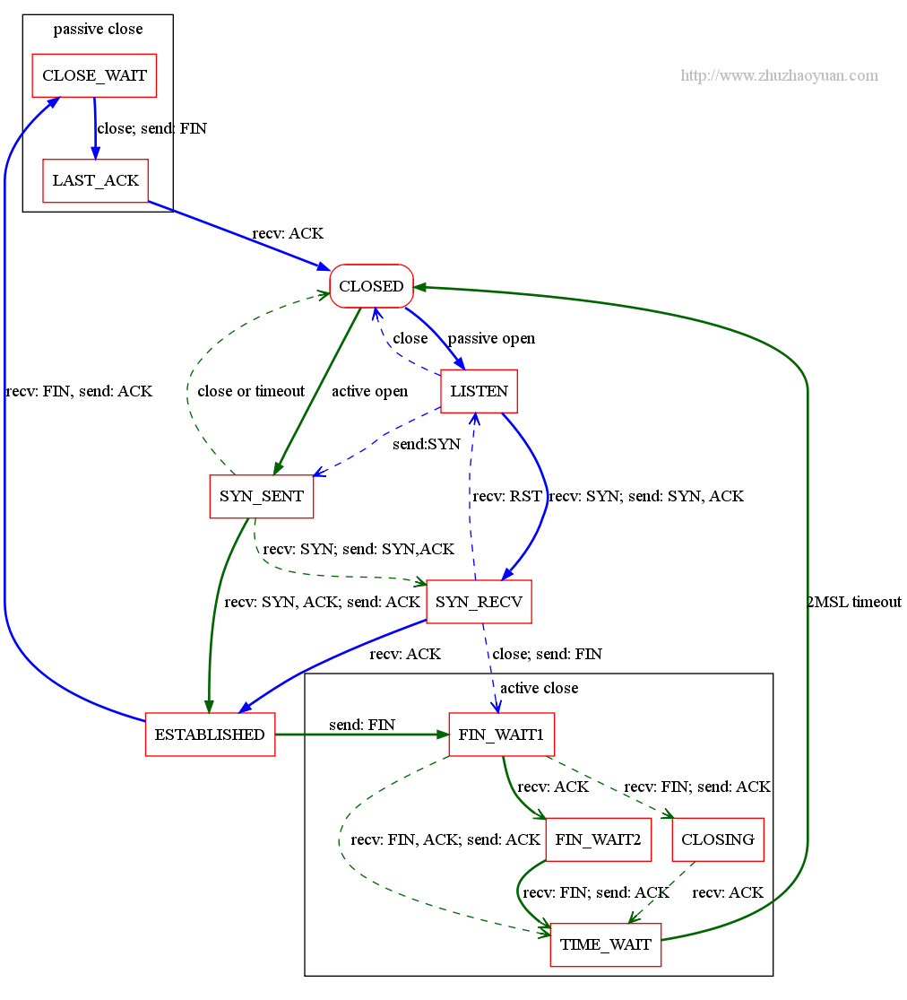
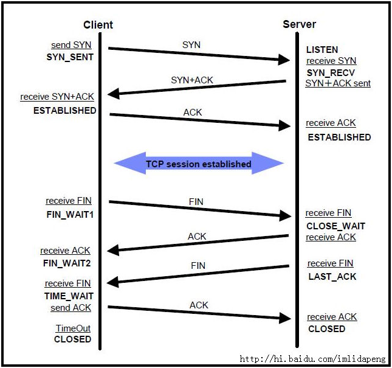

[TOC]

## TCP建立连接需要几次握手
3次。

## TCP断开连接需要几次握手
4次。

## TCP连接状态
TCP状态如下图所示


可能有点眼花缭乱？再看看这个时序图


### SYN_RECV
服务端收到建立连接的SYN没有收到ACK包的时候处在SYN_RECV状态。
在三次握手协议中，服务器维护一个半连接队列，该队列为每个客户端的SYN包开设一个条目(服务端在接收到SYN包的时候，就已经创建了request_sock结构，存储在半连接队列中)，该条目表明服务器已收到SYN包，并向客户发出确认，正在等待客户的确认包（会进行第二次握手发送SYN＋ACK 的包加以确认）。这些条目所标识的连接在服务器处于Syn_RECV状态，当服务器收到客户的确认包时，删除该条目，服务器进入ESTABLISHED状态。

相关系统配置：

1，net.ipv4.tcp_synack_retries
默认值是5
对于远端的连接请求SYN，内核会发送SYN ＋ ACK数据报，以确认收到上一个 SYN连接请求包。这是所谓的三次握手( threeway handshake)机制的第二个步骤。这里决定内核在放弃连接之前所送出的 SYN+ACK 数目。不应该大于255，默认值是5，对应于180秒左右时间。通常我们不对这个值进行修改，因为我们希望TCP连接不要因为偶尔的丢包而无法建立。
2，net.ipv4.tcp_syncookies
一般服务器都会设置net.ipv4.tcp_syncookies=1来防止SYN Flood攻击。假设一个用户向服务器发送了SYN报文后突然死机或掉线，那么服务器在发出SYN+ACK应答报文后是无法收到客户端的ACK报文的（第三次握手无法完成），这种情况下服务器端一般会重试（再次发送SYN+ACK给客户端）并等待一段时间后丢弃这个未完成的连接，这段时间的长度我们称为SYN Timeout，一般来说这个时间是分钟的数量级（大约为30秒-2分钟）。

3，半连接队列长度
对于SYN半连接队列的大小是由（/proc/sys/net/ipv4/tcp_max_syn_backlog）这个内核参数控制的，有些内核似乎也受listen的backlog参数影响，取得是两个值的最小值。当这个队列满了，不开启syncookies的时候，Server会丢弃新来的SYN包，而Client端在多次重发SYN包得不到响应而返回（connection time out）错误。但是，当Server端开启了syncookies=1，那么SYN半连接队列就没有逻辑上的最大值了，并且/proc/sys/net/ipv4/tcp_max_syn_backlog设置的值也会被忽略。 [tcp的半连接与完全连接队列](http://www.jianshu.com/p/ff26312e67a9)

这些处在SYNC_RECV的TCP连接称为半连接，并存储在内核的半连接队列中，在内核收到对端发送的ack包时会查找半连接队列，并将符合的requst_sock信息存储到完成三次握手的连接的队列中，然后删除此半连接。大量SYNC_RECV的TCP连接会导致半连接队列溢出，这样后续的连接建立请求会被内核直接丢弃，这就是SYN Flood攻击。

能够有效防范SYN Flood攻击的手段之一，就是SYN Cookie。SYN Cookie原理由D. J. Bernstain和 Eric Schenk发明。SYN Cookie是对TCP服务器端的三次握手协议作一些修改，专门用来防范SYN Flood攻击的一种手段。它的原理是，在TCP服务器收到TCP SYN包并返回TCP SYN+ACK包时，不分配一个专门的数据区，而是根据这个SYN包计算出一个cookie值。在收到TCP ACK包时，TCP服务器在根据那个cookie值检查这个TCP ACK包的合法性。如果合法，再分配专门的数据区进行处理未来的TCP连接。

### CLOSE_WAIT
发起TCP连接关闭的一方称为client，被动关闭的一方称为server。被动关闭的server收到FIN后，但未发出ACK的TCP状态是CLOSE_WAIT。出现这种状况一般都是由于server端代码的问题，如果你的服务器上出现大量CLOSE_WAIT，应该要考虑检查代码。

### TIME_WAIT
根据TCP协议定义的3次握手断开连接规定，发起socket主动关闭的一方 socket将进入`TIME_WAIT`状态。`TIME_WAIT`状态将持续2个MSL(Max Segment Lifetime)，在Windows下默认为4分钟，即240秒。`TIME_WAIT`状态下的socket不能被回收使用，具体现象是对于一个处理大量短连接的服务器,如果是由服务器主动关闭客户端的连接，将导致服务器端存在大量的处于TIME_WAIT状态的socket， 甚至比处于Established状态下的socket多的多,严重影响服务器的处理能力，甚至耗尽可用的socket，停止服务。

为什么需要`TIME_WAIT`？TIME_WAIT是TCP协议用以保证被重新分配的socket不会受到之前残留的延迟重发报文影响的机制,是必要的逻辑保证。

和TIME_WAIT状态有关的系统参数有一般由3个：
net.ipv4.tcp_tw_recycle = 1
net.ipv4.tcp_tw_reuse = 1
net.ipv4.tcp_fin_timeout = 30

net.ipv4.tcp_fin_timeout，默认60s，减小fin_timeout，减少TIME_WAIT连接数量。

net.ipv4.tcp_tw_reuse = 1表示开启重用。允许将TIME-WAIT sockets重新用于新的TCP连接，默认为0，表示关闭；
net.ipv4.tcp_tw_recycle = 0表示关闭TCP连接中TIME-WAIT sockets的快速回收，默认为0，表示关闭。
注意：使用负载均衡时，不能开启tcp_tw_recycle。

## TCP连接状态统计

统计tcp连接的情况

```shell
# 广告监测点击服务器
[work@lab22 ~]$ netstat -n | awk '/^tcp/ {++S[$NF]} END {for(a in S) print a, S[a]}'
TIME_WAIT 56
FIN_WAIT1 5
FIN_WAIT2 4
ESTABLISHED 340
SYN_RECV 1
```

```shell
# 广告监测曝光lvs服务器
[root@lab23 ~]# date
Thu Jun 15 13:50:50 CST 2017
[root@lab23 ~]# ipvsadm -Lnc| grep TCP | awk '{print $3}' |sort | uniq -c
    465 CLOSE
     16 CLOSE_WAIT
   1539 ESTABLISHED
    272 FIN_WAIT
   7745 SYN_RECV
      1 SYN_SENT
 113083 TIME_WAIT
```

```shell
# 广告监测曝光服务
[work@lab26 ~]$ date
Thu Jun 15 13:50:43 CST 2017
[work@lab26 ~]$ netstat -n | awk '/^tcp/ {++S[$NF]} END {for(a in S) print a, S[a]}'
TIME_WAIT 1950
CLOSE_WAIT 1
FIN_WAIT1 27
SYN_SENT 4
FIN_WAIT2 99
ESTABLISHED 267
SYN_RECV 97
CLOSING 2
LAST_ACK 16
CLOSING 8
LAST_ACK 37
```

# 参考

- [通讯系统经验谈【一】TCP连接状态分析：SYNC_RECV，CLOSE_WAIT，TIME_WAIT](http://maoyidao.iteye.com/blog/1744277)
